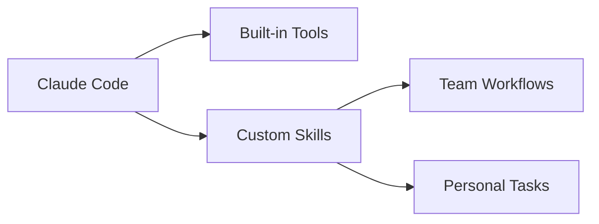
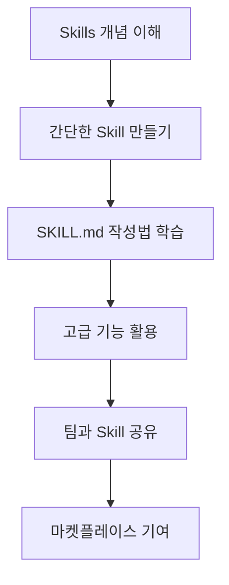

# Claude Code Skills 가이드

> [!info] 문서 정보
> - 작성일: 2025-10-22
> - 버전: Claude Code Skills
> - 출처: https://docs.claude.com/en/docs/claude-code/skills

---

## 목차

- [[#개요]]
- [[#Skills란 무엇인가]]
- [[#주요 특징]]
- [[#Skills 생성하기]]
- [[#Skills 사용하기]]
- [[#고급 기능]]
- [[#Best Practices]]
- [[#예제]]

---

## 개요

**Skills**는 Claude Code의 기능을 확장하는 모듈식 시스템입니다. 특정 작업을 반복 가능한 방식으로 수행하도록 Claude를 가르치는 역할을 합니다.

> [!tip] 핵심 개념
> Skills는 단순한 명령어가 아니라, 조직의 워크플로우와 전문 지식을 Claude에게 전달하는 **지식 캡슐**입니다.

### Skills의 활용 분야

- 🎨 **브랜드 가이드라인**을 따르는 문서 생성
- 📊 **조직의 특정 워크플로우**에 따른 데이터 분석
- 🤖 **반복적인 작업** 자동화
- 📝 **템플릿 기반** 콘텐츠 생성

---

## Skills란 무엇인가

### 정의

Skills는 지침(instructions), 스크립트(scripts), 리소스(resources)를 포함하는 조직화된 폴더 구조입니다.

```
my-skill/
├── SKILL.md          # 필수: 메인 지침 파일
├── templates/        # 선택: 템플릿 파일들
├── scripts/          # 선택: 실행 스크립트들
└── resources/        # 선택: 기타 리소스들
```

### 작동 원리

> [!important] 모델 기반 호출 (Model-Invoked)
> Skills는 **Claude가 자율적으로 결정**하여 호출합니다. 사용자의 요청과 Skill의 설명을 기반으로 관련성이 있을 때 자동으로 로드됩니다.

#### 호출 프로세스

1.	**사용자 요청** 분석
2.	**Skill 설명** 매칭
3.	**자동 로드** 및 실행
4.	**결과 반환**

---

## 주요 특징

### 1. 확장성 (Extensibility)



### 2. 재사용성 (Reusability)

> [!success] 한 번 정의, 여러 번 사용
> Skill을 한 번 만들면 팀 전체가 동일한 방식으로 작업을 수행할 수 있습니다.

### 3. 마켓플레이스

- **공식 저장소**: `anthropics/skills`
- 플러그인 형태로 설치 가능
- 커뮤니티 기여 환영

---

## Skills 생성하기

### 1. 기본 구조

#### SKILL.md 파일 생성

모든 Skill은 **SKILL.md** 파일을 반드시 포함해야 합니다.

```markdown
---
name: "Skill 이름"
description: "Skill에 대한 간단한 설명 (Claude가 이를 읽고 호출 여부를 결정)"
---

# Skill 이름

## 목적
이 Skill이 수행하는 작업에 대한 설명

## 지침

1. 첫 번째 단계
2. 두 번째 단계
3. 세 번째 단계

## 예제

### 입력
예제 입력 내용

### 출력
예제 출력 내용

## 주의사항
- 주의할 점 1
- 주의할 점 2
```

> [!warning] YAML Frontmatter 필수
> - `name`: Skill의 이름 (필수)
> - `description`: Skill에 대한 설명 (필수) - Claude가 이 설명을 보고 Skill 사용 여부를 결정

### 2. YAML Frontmatter 상세

#### 필수 필드

| 필드 | 타입 | 설명 | 예시 |
|------|------|------|------|
| `name` | string | Skill의 고유 이름 | `"Document Generator"` |
| `description` | string | Skill의 목적과 사용 시기 | `"Creates documents following company brand guidelines"` |

#### 선택 필드 (확장 가능)

| 필드 | 타입 | 설명 | 예시 |
|------|------|------|------|
| `version` | string | Skill 버전 | `"1.0.0"` |
| `author` | string | 작성자 | `"Team Name"` |
| `tags` | array | 분류 태그 | `["documentation", "template"]` |

```yaml
---
name: "Company Document Generator"
description: "Generate documents following Acme Corp brand guidelines with proper formatting and tone"
version: "1.2.0"
author: "Marketing Team"
tags: ["documentation", "branding", "template"]
---
```

### 3. 지침 작성 가이드

#### 명확한 단계별 지침

```markdown
## 지침

### 1단계: 요구사항 분석
	- 사용자가 요청한 문서 타입 파악
	- 필요한 정보 수집
	- 대상 독자 확인

### 2단계: 템플릿 선택
	- 문서 타입에 맞는 템플릿 로드
	- 템플릿 경로: `templates/{document_type}.md`

### 3단계: 콘텐츠 생성
	- 브랜드 톤 앤 매너 적용
	- 회사 로고 및 헤더 삽입
	- 적절한 서식 적용

### 4단계: 검증
	- 맞춤법 검사
	- 브랜드 가이드라인 준수 확인
	- 사용자에게 검토 요청
```

> [!tip] 효과적인 지침 작성
> - **구체적으로**: 모호한 표현 피하기
> - **단계별로**: 논리적 순서 유지
> - **예제 포함**: 실제 사용 사례 제공
> - **예외 처리**: 오류 상황 대응 방법 명시

### 4. 파일 구조 예제

#### 복잡한 Skill 예제

```
document-generator/
├── SKILL.md                    # 메인 지침
├── README.md                   # 사용자용 문서
├── templates/
│   ├── memo.md                # 메모 템플릿
│   ├── report.md              # 보고서 템플릿
│   └── proposal.md            # 제안서 템플릿
├── scripts/
│   ├── format_check.py        # 서식 검증 스크립트
│   └── export_pdf.sh          # PDF 변환 스크립트
├── resources/
│   ├── brand_colors.json      # 브랜드 컬러 정의
│   ├── logo.png               # 회사 로고
│   └── style_guide.md         # 스타일 가이드
└── examples/
	├── sample_memo.md         # 예제 메모
	└── sample_report.md       # 예제 보고서
```

---

## Skills 사용하기

### 1. 설치 및 설정

#### 요구사항

> [!important] 사용 가능 플랜
> - ✅ Pro
> - ✅ Max
> - ✅ Team
> - ✅ Enterprise
>
> **필수**: Code Execution Tool 베타 활성화

#### 마켓플레이스에서 설치

```bash
# Skills 저장소 클론
git clone https://github.com/anthropics/skills

# 특정 Skill 설치
claude skill install <skill-name>

# 설치된 Skills 확인
claude skill list
```

### 2. Skill 호출하기

#### 자동 호출 (권장)

Claude가 자동으로 관련 Skill을 감지하고 사용합니다.

```
사용자: "회사 브랜드 가이드라인에 맞춰 Q4 보고서를 작성해줘"

Claude: [Document Generator Skill 자동 감지 및 로드]
        보고서를 작성하겠습니다...
```

#### 수동 호출

시스템 프롬프트에서 Skill 도구를 사용할 수 있습니다:

```python
# Skill 도구 사용 (내부 API)
invoke_skill(name="document-generator",
             params={"type": "report", "quarter": "Q4"})
```

### 3. Skill 상태 확인

```bash
# 현재 활성화된 Skills
claude skill active

# Skill 상세 정보
claude skill info <skill-name>

# Skill 로그 확인
claude skill logs <skill-name>
```

---

## 고급 기능

### 1. 파라미터화된 Skills

#### 동적 파라미터 사용

```markdown
---
name: "Data Analyzer"
description: "Analyze data using specified methods and generate reports"
---

## 파라미터

- `data_source`: 데이터 소스 경로 (필수)
- `analysis_type`: 분석 타입 [descriptive, predictive, prescriptive] (기본: descriptive)
- `output_format`: 출력 형식 [json, csv, markdown] (기본: markdown)

## 지침

### 데이터 로드
	1. `{data_source}`에서 데이터 읽기
	2. 데이터 유효성 검증
	3. 전처리 수행

### 분석 수행
	- `{analysis_type}`에 따른 분석 메서드 선택
		- **descriptive**: 기술통계량 계산
		- **predictive**: 예측 모델 적용
		- **prescriptive**: 최적화 알고리즘 실행

### 결과 출력
	- `{output_format}` 형식으로 변환
	- 시각화 생성 (해당하는 경우)
```

### 2. Skills 체이닝

여러 Skills를 연결하여 복잡한 워크플로우 구성:

```markdown
## Workflow: 데이터 분석 → 보고서 생성

1. **Data Analyzer Skill** 실행
	- 입력: raw_data.csv
	- 출력: analysis_results.json

2. **Chart Generator Skill** 실행
	- 입력: analysis_results.json
	- 출력: charts/*.png

3. **Document Generator Skill** 실행
	- 입력: analysis_results.json, charts/
	- 출력: final_report.md
```

### 3. 조건부 로직

```markdown
## 지침

### 데이터 크기에 따른 처리

IF 데이터 크기 < 1MB:
	- 메모리에서 직접 처리
	- 단일 스레드 사용

ELIF 데이터 크기 < 100MB:
	- 청크 단위 처리
	- 멀티 프로세싱 사용

ELSE:
	- 스트리밍 처리
	- 분산 처리 프레임워크 사용 (Dask/Spark)
```

### 4. 에러 처리

```markdown
## 에러 처리

### 일반적인 오류

1. **파일을 찾을 수 없음**
	```
	ERROR: File not found at {path}
	SOLUTION:
	- 경로 확인
	- 사용자에게 올바른 경로 요청
	```

2. **데이터 형식 오류**
	```
	ERROR: Invalid data format
	SOLUTION:
	- 지원되는 형식 목록 제공
	- 형식 변환 옵션 제안
	```

3. **권한 오류**
	```
	ERROR: Permission denied
	SOLUTION:
	- Code Execution Tool 활성화 확인
	- 관리자에게 문의 안내
	```

### 예외 상황 처리 흐름

TRY:
	작업 수행
CATCH FileNotFoundError:
	사용자에게 경로 확인 요청
	대안 경로 제안
CATCH PermissionError:
	권한 설정 안내
	관리자 연락처 제공
FINALLY:
	임시 파일 정리
	리소스 해제
```

---

## Best Practices

### 1. Skill 설계 원칙

> [!success] SOLID 원칙 적용
> - **Single Responsibility**: 하나의 Skill은 하나의 명확한 목적
> - **Open/Closed**: 확장 가능하되 수정은 최소화
> - **Liskov Substitution**: 일관된 인터페이스 유지
> - **Interface Segregation**: 필요한 기능만 노출
> - **Dependency Inversion**: 추상화에 의존

#### 좋은 예제

```markdown
---
name: "PDF Report Generator"
description: "Generate PDF reports from markdown files with charts and tables"
---
```

❌ **나쁜 예제**: 너무 광범위

```markdown
---
name: "Document Processor"
description: "Does everything with documents"
---
```

### 2. 설명(Description) 작성 가이드

> [!tip] Claude가 이해하기 쉽게
> - **구체적**: 정확히 무엇을 하는지
> - **간결**: 1-2문장으로 요약
> - **키워드 포함**: 관련 용어 명시

#### 효과적인 Description 예제

✅ **좋은 예제**:
```yaml
description: "Generate quarterly sales reports with revenue analysis, customer segmentation charts, and trend predictions using company template"
```

✅ **좋은 예제**:
```yaml
description: "Convert Jupyter notebooks to HTML presentations with syntax highlighting and interactive plots for technical documentation"
```

❌ **나쁜 예제**:
```yaml
description: "Helps with reports"
```

### 3. 문서화

#### 필수 포함 사항

- [ ] 명확한 목적 설명
- [ ] 단계별 사용 방법
- [ ] 입력/출력 예제
- [ ] 제한사항 및 주의사항
- [ ] 버전 정보
- [ ] 연락처/지원 채널

#### 템플릿

```markdown
---
name: "Skill Name"
description: "Clear, concise description"
version: "1.0.0"
author: "Team/Person"
---

# Skill Name

## 📋 개요
이 Skill의 목적과 주요 기능

## 🎯 사용 사례
- 사용 사례 1
- 사용 사례 2
- 사용 사례 3

## 📥 입력
필요한 입력 데이터/파라미터

## 📤 출력
생성되는 결과물

## 🔧 지침
상세한 실행 단계

## 💡 예제
실제 사용 예제

## ⚠️ 제한사항
알려진 제한사항

## 🆘 문제 해결
일반적인 문제와 해결방법

## 📝 변경 이력
버전별 변경사항
```

### 4. 성능 최적화

#### 빠른 실행을 위한 팁

1.	**최소한의 파일 읽기**: 필요한 파일만 로드
2.	**캐싱 활용**: 반복 계산 결과 저장
3.	**조기 검증**: 입력 유효성을 먼저 확인
4.	**병렬 처리**: 독립적인 작업은 동시 실행

```markdown
## 성능 최적화 지침

### 1. 입력 검증 (조기 실패)
	- 파라미터 유효성 즉시 확인
	- 잘못된 입력 시 즉시 오류 반환

### 2. 리소스 캐싱
	- 템플릿 파일은 메모리에 캐시
	- 설정 파일은 한 번만 읽기

### 3. 점진적 처리
	- 대용량 데이터는 스트리밍
	- 진행 상황 표시

### 4. 리소스 정리
	- 사용 후 임시 파일 삭제
	- 메모리 해제
```

### 5. 보안 고려사항

> [!danger] 보안 체크리스트
> - [ ] 사용자 입력 검증 (인젝션 공격 방지)
> - [ ] 파일 경로 검증 (디렉토리 트래버설 방지)
> - [ ] 민감 정보 로깅 금지
> - [ ] 권한 최소화 원칙 적용
> - [ ] 의존성 정기 업데이트

```markdown
## 보안 지침

### 입력 검증
	- 모든 사용자 입력 검증
	- 화이트리스트 기반 필터링
	- 특수 문자 이스케이핑

### 파일 접근
	- 허용된 디렉토리 내에서만 작업
	- 절대 경로 사용 금지
	- 심볼릭 링크 처리 주의

### 민감 정보 처리
	- API 키는 환경 변수에서 로드
	- 로그에 민감 정보 출력 금지
	- 임시 파일 안전하게 삭제
```

---

## 예제

### 예제 1: 간단한 Markdown 템플릿 생성기

```markdown
---
name: "Meeting Notes Generator"
description: "Create structured meeting notes from agenda and discussion points"
version: "1.0.0"
---

# Meeting Notes Generator

## 목적
회의 안건과 논의 사항을 구조화된 회의록으로 변환

## 지침

### 1. 정보 수집
	사용자에게 다음 정보 요청:
	- 회의 제목
	- 날짜 및 시간
	- 참석자 목록
	- 안건 항목
	- 주요 논의 내용
	- 액션 아이템

### 2. 템플릿 적용
	다음 구조로 문서 생성:

	```
	# {회의 제목}

	**날짜**: {날짜}
	**시간**: {시간}
	**참석자**: {참석자 목록}

	## 안건
	{안건 항목 목록}

	## 논의 내용
	{각 안건별 논의 사항}

	## 결정 사항
	{주요 결정 사항}

	## 액션 아이템
	- [ ] {액션 아이템 1} - {담당자} - {기한}
	- [ ] {액션 아이템 2} - {담당자} - {기한}

	## 다음 회의
	**예정일**: {다음 회의 날짜}
	```

### 3. 검토
	- 빠진 정보 확인
	- 형식 일관성 점검
	- 사용자에게 확인 요청

## 예제

### 입력
```
회의 제목: 제품 로드맵 논의
날짜: 2025-10-22
참석자: Alice, Bob, Charlie
안건:
1. Q4 목표 검토
2. 신규 기능 우선순위
3. 리소스 배분
```

### 출력
```markdown
# 제품 로드맵 논의

**날짜**: 2025-10-22
**참석자**: Alice, Bob, Charlie

## 안건
1. Q4 목표 검토
2. 신규 기능 우선순위
3. 리소스 배분

[... 나머지 내용]
```
```

### 예제 2: 데이터 분석 및 시각화

```markdown
---
name: "Sales Data Analyzer"
description: "Analyze sales CSV files and generate visualizations with insights for monthly/quarterly reports"
version: "2.1.0"
author: "Analytics Team"
tags: ["data-analysis", "visualization", "sales"]
---

# Sales Data Analyzer

## 목적
판매 데이터를 분석하고 인사이트가 포함된 리포트 생성

## 파라미터

- `data_file`: CSV 파일 경로 (필수)
- `period`: 분석 기간 [monthly, quarterly, yearly] (기본: monthly)
- `metrics`: 분석할 지표 목록 (기본: ["revenue", "units", "growth"])
- `visualizations`: 생성할 차트 타입 (기본: ["line", "bar", "pie"])

## 지침

### 1. 데이터 검증
	```python
	import pandas as pd

	# CSV 로드
	df = pd.read_csv(data_file)

	# 필수 컬럼 확인
	required_columns = ['date', 'product', 'quantity', 'revenue']
	if not all(col in df.columns for col in required_columns):
		raise ValueError(f"Missing required columns: {required_columns}")

	# 날짜 형식 변환
	df['date'] = pd.to_datetime(df['date'])
	```

### 2. 기술 통계 계산
	```python
	# 기간별 집계
	if period == 'monthly':
		grouped = df.groupby(df['date'].dt.to_period('M'))
	elif period == 'quarterly':
		grouped = df.groupby(df['date'].dt.to_period('Q'))
	else:
		grouped = df.groupby(df['date'].dt.to_period('Y'))

	# 주요 메트릭 계산
	metrics_data = {
		'revenue': grouped['revenue'].sum(),
		'units': grouped['quantity'].sum(),
		'avg_price': grouped['revenue'].sum() / grouped['quantity'].sum(),
		'growth': grouped['revenue'].sum().pct_change() * 100
	}
	```

### 3. 시각화 생성
	```python
	import matplotlib.pyplot as plt

	# 매출 추이 그래프
	if 'line' in visualizations:
		plt.figure(figsize=(12, 6))
		metrics_data['revenue'].plot(kind='line', marker='o')
		plt.title(f'{period.capitalize()} Revenue Trend')
		plt.ylabel('Revenue ($)')
		plt.xlabel('Period')
		plt.grid(True)
		plt.savefig('charts/revenue_trend.png')
		plt.close()

	# 제품별 비중 파이 차트
	if 'pie' in visualizations:
		product_revenue = df.groupby('product')['revenue'].sum()
		plt.figure(figsize=(10, 10))
		product_revenue.plot(kind='pie', autopct='%1.1f%%')
		plt.title('Revenue by Product')
		plt.ylabel('')
		plt.savefig('charts/revenue_by_product.png')
		plt.close()
	```

### 4. 인사이트 추출
	```python
	insights = []

	# 성장률 분석
	avg_growth = metrics_data['growth'].mean()
	if avg_growth > 10:
		insights.append(f"Strong growth trajectory: {avg_growth:.1f}% average")
	elif avg_growth < 0:
		insights.append(f"Declining trend: {avg_growth:.1f}% average")

	# 최고/최저 성과 기간
	best_period = metrics_data['revenue'].idxmax()
	worst_period = metrics_data['revenue'].idxmin()
	insights.append(f"Best performing period: {best_period}")
	insights.append(f"Needs attention: {worst_period}")

	# 상위 제품
	top_products = df.groupby('product')['revenue'].sum().nlargest(3)
	insights.append(f"Top 3 products: {', '.join(top_products.index)}")
	```

### 5. 리포트 생성
	```markdown
	# Sales Analysis Report - {period.capitalize()}

	## Executive Summary
	{주요 인사이트 요약}

	## Key Metrics
	- Total Revenue: ${total_revenue:,.2f}
	- Total Units Sold: {total_units:,}
	- Average Growth Rate: {avg_growth:.1f}%
	- Average Price: ${avg_price:.2f}

	## Trends
	

	## Product Performance
	

	## Insights
	{인사이트 목록}

	## Recommendations
	{데이터 기반 권장사항}
	```

## 예제 실행

### 입력
```
사용자: sales_2025_q3.csv 파일을 분석해서 분기 리포트를 만들어줘
```

### Claude의 처리
```
1. Sales Data Analyzer Skill 감지 및 로드
2. 파라미터 설정: period='quarterly', data_file='sales_2025_q3.csv'
3. 데이터 검증 및 분석 수행
4. 차트 생성: revenue_trend.png, revenue_by_product.png
5. 리포트 생성: sales_analysis_q3_2025.md
```

### 출력
```markdown
# Sales Analysis Report - Quarterly

## Executive Summary
Q3 2025 showed strong performance with 15.3% growth compared to Q2...

## Key Metrics
- Total Revenue: $1,245,678.90
- Total Units Sold: 8,432
- Average Growth Rate: 15.3%
- Average Price: $147.72

[... 차트 및 상세 분석]
```
```

### 예제 3: 코드 리뷰 자동화

```markdown
---
name: "Code Review Assistant"
description: "Review Python code for best practices, security issues, and suggest improvements"
version: "1.5.0"
tags: ["code-review", "python", "quality"]
---

# Code Review Assistant

## 목적
Python 코드의 품질, 보안, 성능을 자동으로 검토

## 검토 항목

### 1. 코드 스타일 (PEP 8)
	- 들여쓰기 (4 spaces)
	- 줄 길이 (최대 79자)
	- 네이밍 컨벤션
	- Import 순서

### 2. 보안 취약점
	- SQL Injection 가능성
	- XSS 취약점
	- 하드코딩된 민감 정보
	- 안전하지 않은 deserialization

### 3. 성능 이슈
	- 불필요한 반복문
	- 메모리 누수 가능성
	- 비효율적인 알고리즘
	- 데이터베이스 쿼리 최적화

### 4. 모범 사례
	- 에러 처리
	- 로깅
	- 문서화 (docstrings)
	- 타입 힌팅

## 지침

### 1. 코드 분석
	```python
	import ast
	import pylint.lint
	from bandit import manager

	# 구문 분석
	with open(file_path) as f:
		code = f.read()
		tree = ast.parse(code)

	# Pylint 실행
	pylint_output = pylint.lint.Run([file_path], exit=False)

	# Bandit 보안 검사
	b_mgr = manager.BanditManager(None, 'file')
	b_mgr.discover_files([file_path])
	b_mgr.run_tests()
	```

### 2. 이슈 분류
	```python
	issues = {
		'critical': [],  # 보안 취약점, 심각한 버그
		'major': [],     # 성능 이슈, 나쁜 패턴
		'minor': [],     # 스타일, 컨벤션
		'suggestions': [] # 개선 제안
	}
	```

### 3. 리포트 생성
	```markdown
	# Code Review: {filename}

	## 📊 Summary
	- Critical Issues: {count}
	- Major Issues: {count}
	- Minor Issues: {count}
	- Suggestions: {count}

	## 🔴 Critical Issues

	### Issue 1: SQL Injection Vulnerability
	**Location**: Line 45
	**Code**:
	\`\`\`python
	query = f"SELECT * FROM users WHERE id = {user_id}"
	\`\`\`
	**Problem**: Direct string interpolation in SQL query
	**Fix**:
	\`\`\`python
	query = "SELECT * FROM users WHERE id = ?"
	cursor.execute(query, (user_id,))
	\`\`\`

	## 🟡 Major Issues
	[...]

	## 🟢 Minor Issues
	[...]

	## 💡 Suggestions
	[...]

	## ✅ Good Practices Found
	- Proper use of context managers
	- Good test coverage
	- Clear variable names
	```

## 예제

### 입력 코드
```python
def get_user(user_id):
	db = connect_to_db()
	query = f"SELECT * FROM users WHERE id = {user_id}"
	result = db.execute(query)
	return result
```

### 검토 결과
```markdown
## 🔴 Critical Issues

### SQL Injection Vulnerability
**Line**: 3
**Severity**: Critical
**Fix**: Use parameterized queries

### Resource Leak
**Line**: 2
**Severity**: Critical
**Fix**: Use context manager or close connection

## 💡 Improved Code
\`\`\`python
def get_user(user_id: int) -> dict:
	"""
	Retrieve user by ID.

	Args:
		user_id: The user's unique identifier

	Returns:
		User data dictionary

	Raises:
		ValueError: If user_id is invalid
	"""
	if not isinstance(user_id, int) or user_id <= 0:
		raise ValueError("Invalid user_id")

	with connect_to_db() as db:
		query = "SELECT * FROM users WHERE id = ?"
		result = db.execute(query, (user_id,))
		return result.fetchone()
\`\`\`
```
```

---

## 추가 리소스

### 공식 문서

- 📚 [Skills Documentation](https://docs.claude.com/en/docs/claude-code/skills)
- 🚀 [Skills 발표 블로그](https://www.anthropic.com/news/skills)
- 🛠️ [Engineering Deep Dive](https://www.anthropic.com/engineering/equipping-agents-for-the-real-world-with-agent-skills)
- 💬 [Help Center](https://support.claude.com/en/articles/12512176-what-are-skills)

### 커뮤니티

- 🐙 [GitHub Repository](https://github.com/anthropics/skills)
- 💡 [Skills Marketplace](https://github.com/anthropics/skills)
- 🤝 [기여 가이드](https://github.com/anthropics/skills/blob/main/CONTRIBUTING.md)

### 학습 경로



> [!quote] Best Practice
> "Start simple, iterate often, and always think about reusability"

---

## FAQ

### Q1: Skill과 Slash Command의 차이는?

> [!info] 비교
>
> **Slash Command** (`/command`)
> - 사용자가 명시적으로 호출
> - 간단한 워크플로우
> - 즉각적인 실행
>
> **Skills**
> - Claude가 자동으로 감지 및 호출
> - 복잡한 로직과 리소스 포함
> - 컨텍스트 기반 활성화

### Q2: Skills는 어떻게 버전 관리하나요?

```markdown
---
name: "My Skill"
version: "2.0.0"  # Semantic Versioning
---

## Changelog

### 2.0.0 (2025-10-15)
- Breaking: Changed output format
- Added: Multi-language support

### 1.1.0 (2025-09-01)
- Added: PDF export
- Fixed: Error handling

### 1.0.0 (2025-08-01)
- Initial release
```

### Q3: 팀 전체가 Skills를 공유하려면?

#### 옵션 1: Git 저장소

```bash
# 팀 Skills 저장소 생성
git init team-skills
cd team-skills

# Skills 추가
mkdir -p skills/document-generator
cp SKILL.md skills/document-generator/

# 공유
git remote add origin https://github.com/company/team-skills
git push -u origin main
```

#### 옵션 2: 엔터프라이즈 배포

> [!tip] 엔터프라이즈 플랜
> - 중앙 집중식 Skill 관리
> - 자동 배포 및 업데이트
> - 접근 권한 제어

### Q4: Skills 디버깅은 어떻게 하나요?

```markdown
## 디버깅 팁

### 1. 로깅 추가
	```python
	import logging

	logging.basicConfig(level=logging.DEBUG)
	logger = logging.getLogger(__name__)

	logger.debug("Processing step 1")
	logger.info("User input: %s", user_input)
	logger.error("Failed to load file: %s", error)
	```

### 2. 테스트 케이스 작성
	```python
	# tests/test_skill.py
	import unittest

	class TestDocumentGenerator(unittest.TestCase):
		def test_basic_generation(self):
			result = generate_document(title="Test")
			self.assertIn("# Test", result)
	```

### 3. 점진적 개발
	- 작은 단위로 테스트
	- 각 단계별 출력 확인
	- 사용자 피드백 수집
```

### Q5: Code Execution Tool이 비활성화되어 있다면?

> [!warning] Code Execution Tool 필수
>
> Skills는 Code Execution Tool 베타가 필요합니다.
>
> **활성화 방법**:
> 1. Claude 설정 → Tools
> 2. "Code Execution" 활성화
> 3. 베타 기능 동의
>
> **대안**:
> - 간단한 작업은 Slash Commands 사용
> - 읽기 전용 작업은 일반 Claude 사용

---

## 체크리스트

### Skill 개발 체크리스트

#### 계획 단계
- [ ] Skill의 목적 명확히 정의
- [ ] 사용자 스토리 작성
- [ ] 필요한 리소스 파악
- [ ] 유사한 Skill 조사

#### 개발 단계
- [ ] SKILL.md 생성
- [ ] YAML frontmatter 작성 (name, description 필수)
- [ ] 단계별 지침 작성
- [ ] 예제 추가
- [ ] 에러 처리 구현
- [ ] 필요한 스크립트/템플릿 작성

#### 테스트 단계
- [ ] 기본 기능 테스트
- [ ] 엣지 케이스 테스트
- [ ] 에러 시나리오 테스트
- [ ] 성능 테스트
- [ ] 보안 검토

#### 문서화 단계
- [ ] README 작성
- [ ] 사용 예제 추가
- [ ] FAQ 작성
- [ ] 제한사항 명시
- [ ] 버전 정보 기록

#### 배포 단계
- [ ] 버전 번호 확정
- [ ] CHANGELOG 업데이트
- [ ] 팀 리뷰 완료
- [ ] 저장소에 푸시
- [ ] 사용자 교육

---

## 결론

> [!success] Skills의 장점
> - ⚡ **효율성**: 반복 작업 자동화
> - 🎯 **일관성**: 팀 전체가 동일한 방식으로 작업
> - 📈 **확장성**: 조직의 성장과 함께 확장
> - 🤝 **협업**: 지식과 워크플로우 공유
> - 🔄 **재사용성**: 한 번 만들면 계속 사용

### 다음 단계

1.	**첫 Skill 만들기**: 간단한 템플릿 생성기부터 시작
2.	**팀과 공유**: 동료들의 피드백 수집
3.	**반복 개선**: 사용하면서 지속적으로 개선
4.	**커뮤니티 기여**: 유용한 Skills를 오픈소스로 공유

---

**Tags**: #claude-code #skills #automation #ai #productivity

**Last Updated**: 2025-10-22
